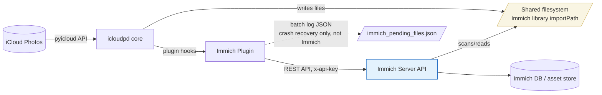
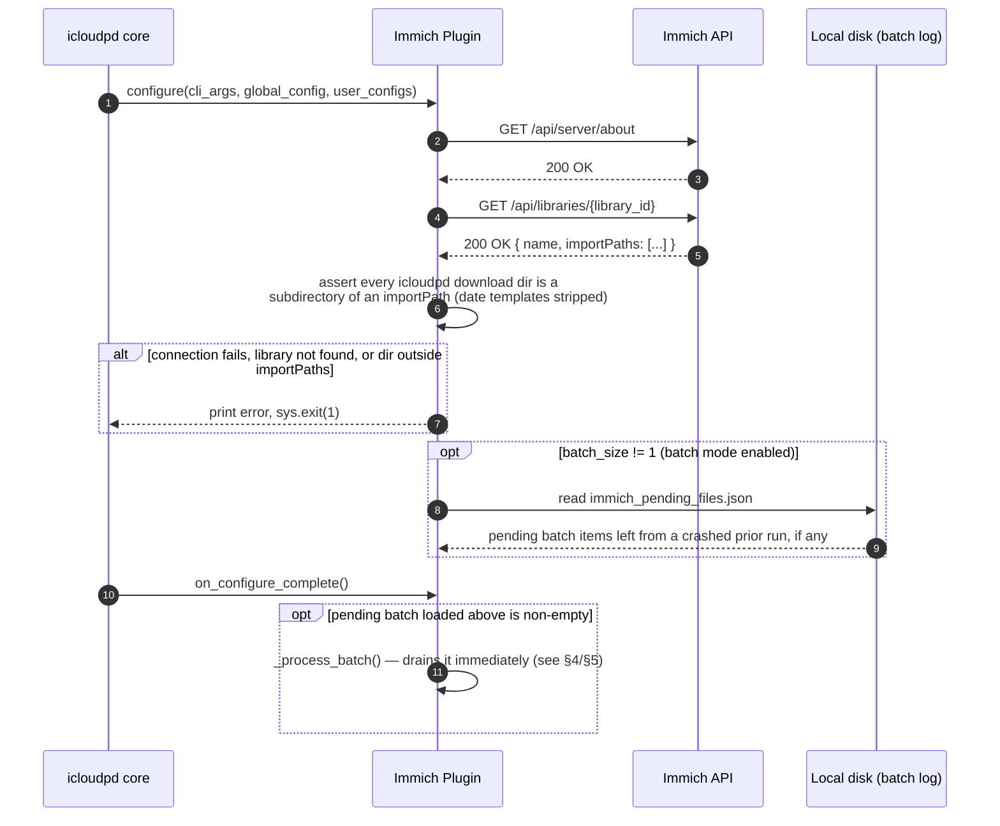
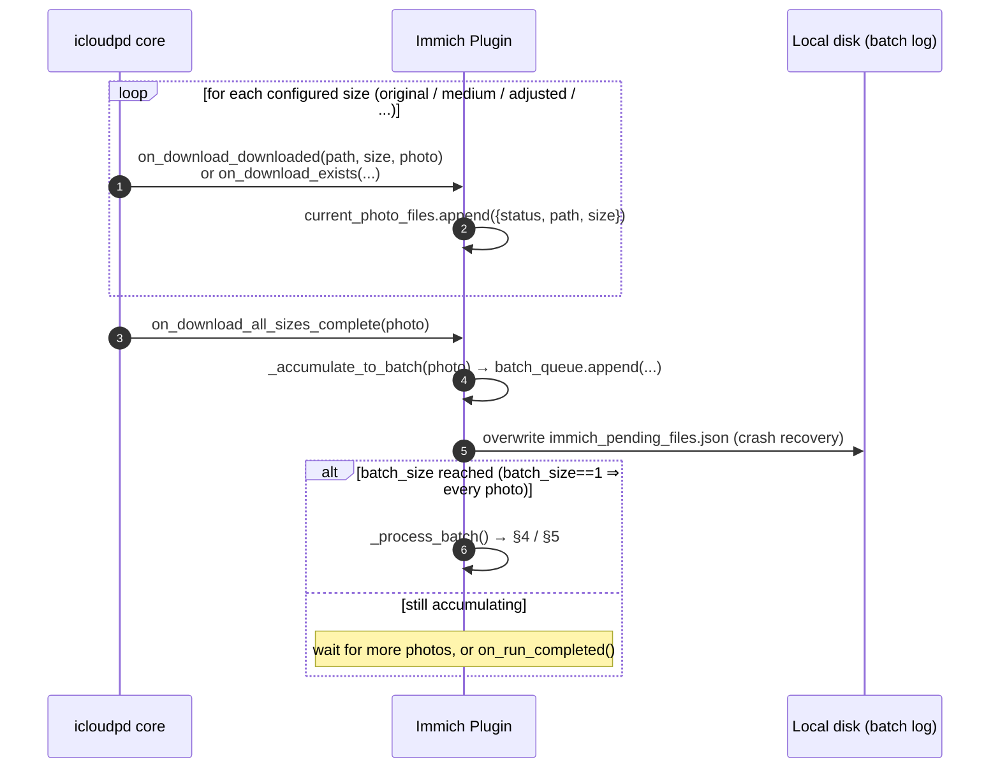
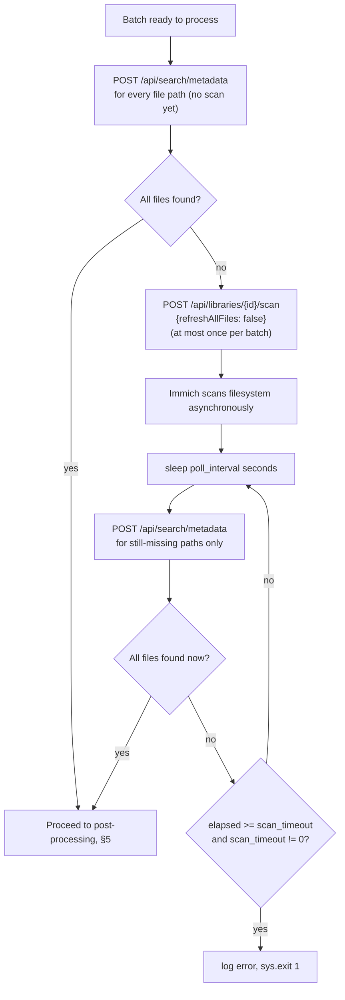
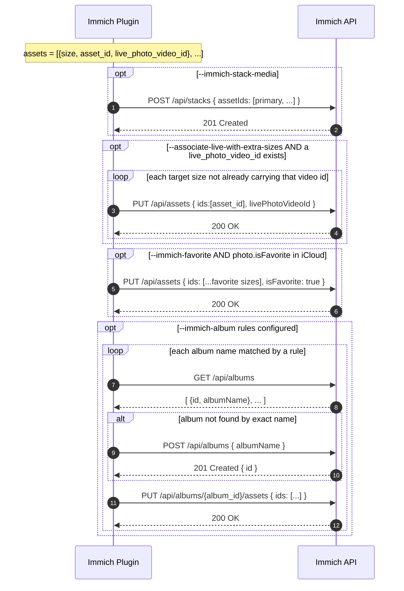

# Immich Plugin — Complete Immich Interaction Reference

Generated from `plugins/immich/immich.py` (plugin v2.0.5), for discussion with
Immich upstream about API contract changes. This document is descriptive of
the code as-is, not aspirational.

**Key fact for readers unfamiliar with this integration:** the plugin never
uploads photo bytes to Immich. icloudpd writes files to a directory shared
with Immich (the library's `importPaths`), and the plugin only talks to
Immich's management/metadata REST API (`x-api-key` auth) to tell it to scan,
then to query/organize what it found.

---

## 1. Architecture / data flow

---

## 2. Startup / configuration validation

Runs once per icloudpd invocation, before any downloads happen.

---

## 3. Per-size download hooks → batch accumulation

Purely local bookkeeping; no Immich calls happen here. This is what feeds
the registration pipeline in §4.

---

## 4. Asset registration algorithm (search-before-scan)

This is the part most sensitive to upstream API/behavior changes — it's a
polling loop built entirely on `/api/search/metadata` exact-path lookups
plus a single library-scan trigger per batch.

Notes:
- Every photo group whose files become fully available mid-poll is
  processed immediately (`_process_ready_groups`), not just at the end —
  so a batch of N photos can finish at N different times within one poll loop.
- `scan_timeout=0` means wait indefinitely.

---

## 5. Post-processing pipeline (per photo group)

Runs once all of a photo's size-variant files are confirmed registered as
Immich assets.

`on_run_completed()` drains any still-pending batch through §4/§5 one more
time, then logs a summary (`total_photos`, `total_registered`,
`total_stacked`, `total_favorited`, `total_live_associated`,
`total_added_to_albums`). `cleanup()` is a no-op.

---

## 6. Complete Immich API surface used

All requests send header `x-api-key: <api_key>`. This is the entire set of
endpoints the plugin depends on.

| # | Method | Endpoint | Purpose | Called from | Request body | Frequency |
|---|--------|----------|---------|--------------|---------------|-----------|
| 1 | GET  | `/api/server/about` | Connectivity/auth check | `_test_immich_connection` | – | once at startup |
| 2 | GET  | `/api/libraries/{library_id}` | Validate library exists; read `name` + `importPaths` | `_test_immich_connection`, `_validate_directories` | – | 1–2× at startup |
| 3 | POST | `/api/libraries/{library_id}/scan` | Trigger external library rescan | `_trigger_library_scan` | `{ refreshAllFiles: false }` | ≤1 per batch |
| 4 | POST | `/api/search/metadata` | Look up one asset by exact `originalPath` | `_search_asset_by_path` | `{ originalPath: <abs path> }` | per file, repeated while polling |
| 5 | POST | `/api/stacks` | Group size variants into a stack (first id = primary) | `_create_stack` | `{ assetIds: [...] }` | once per photo group, if stacking enabled |
| 6 | PUT  | `/api/assets` | Bulk-set `isFavorite` | `_set_favorite` | `{ ids: [...], isFavorite }` | once per photo group, if favoriting enabled |
| 6b| PUT  | `/api/assets` | Set `livePhotoVideoId` (single asset per call) | `_associate_live_photo` | `{ ids: [asset_id], livePhotoVideoId }` | once per target size, if live-assoc enabled |
| 7 | GET  | `/api/albums` | List all albums, find by exact `albumName` | `_get_or_create_album` | – | once per album name touched |
| 8 | POST | `/api/albums` | Create album if not found in step 7 | `_get_or_create_album` | `{ albumName }` | once per new album |
| 9 | PUT  | `/api/albums/{album_id}/assets` | Add assets to album | `_add_assets_to_album` | `{ ids: [...] }` | once per album per photo group |

---

## 7. Behavioral assumptions baked into this plugin

These are documented in the top-of-file docstring in `immich.py` and are
the most likely candidates if upstream API *semantics* (not just schema)
have shifted — worth confirming line-by-line with the Immich team:

- **Stacking**: stacks are visual groupings only, not independently
  addressable by ID; stacked assets don't appear grouped in albums; deleting
  a stack leaves favorited member assets in favorites.
- **Favoriting**: individual assets or whole stacks can be favorited;
  favorited assets within a stack still show stacked in the favorites view.
- **Albums**: stacks cannot be added to albums — only individual assets;
  this plugin deliberately dropped a `[stacked]` album-rule target for that
  reason (see `AlbumRule.__init__`).
- **Live photos**: Immich auto-associates a MOV with the *original* HEIC
  only; the plugin's `--associate-live-with-extra-sizes` exists purely to
  extend that association to other size variants via `livePhotoVideoId`.
- **External library scan**: `POST /api/libraries/{id}/scan` is
  fire-and-forget/async — the plugin has no scan-completion signal and only
  infers completion by polling `/api/search/metadata` until expected paths
  resolve, bounded by `--immich-scan-timeout`.

README states this plugin was "tested with Immich v1.100+" — worth
establishing which version(s) the current break has been observed against.
